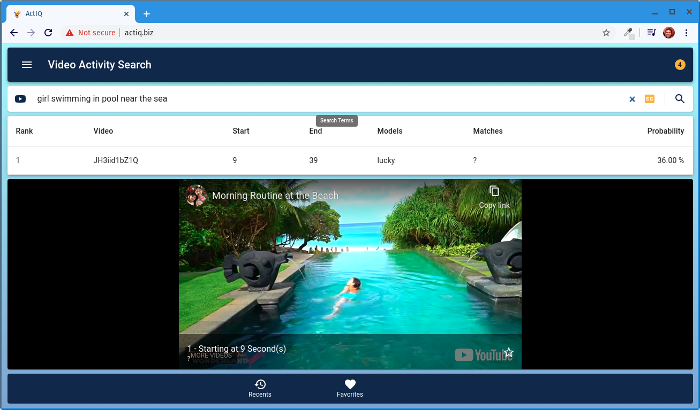

# ActIQ : Video Activity Intelligent Query

ActIQ was developed for MIDS Capstone Project by Pri Nonis, Connor Stern, and Vincio De Sola. ActIQ makes any video stream queryable to pin point complex events within a specific video. Users can use natural language to query the index :

 - “toddler walking at the beach during sunset in hawaii”  
 - “girl swimming in a pool near the ocean”  
 - “man falling down steps at a music concert”  

ActIQ provides a responsive web application to import your videos and then make and receive highly accurate and lightning fast results. The returned videos start precisely when the activity was detected.

Work In Progress